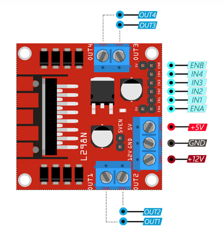

[](https://github.com/aubino/Robot_Firmware/actions/workflows/pio_ci.yml)

# Robot_Firmware
This package contains the low level firmware of my robot. 
It is used to drive wheels and poerform a closed loop control over them for now. 

# Hardware configuration 
- The following hardware are used for the robot : 
    
    - An ESP32  : 
        
        

    - An L298N H bridge : 
        
        
    
    - A 11.1 V Lipo battery
        
        

    - An MPU6050 to extract orientation 

        

    - A TOBSUN buck dc-dc converter 

        

    - Two wheels with encoders

    
The pinout layout is as follows : 
```yaml
- Left wheel : 
    - Power : 
        - Forward : D15
        - Backward: D2
        - PWM : D4
    - Encoders : 
        - PinA : D17
        - PinB : D16
- Right wheel : 
    - Power : 
        - Forward : D26
        - Backward : D27 
        - PWM : D14
    - Encoders : 
        - PinA : D13
        - PinB : D12
```

# Software Configuration 
- For continuous integration and unitests look [here](https://piolabs.com/blog/insights/unit-testing-part-1.html) for PlatformIO instructions . 
- For ros trough wifi : https://registry.platformio.org/libraries/frankjoshua/Rosserial%20Arduino%20Library/examples/Odom/Odom.pde
